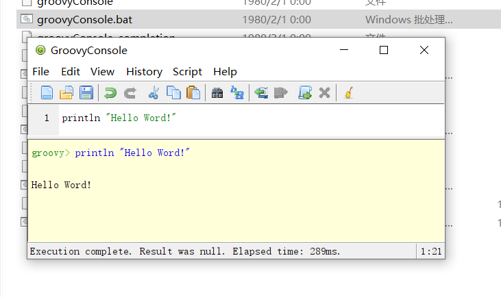

# 概述

## 什么是groovy

groovy是用于java虚拟机的一种敏捷的动态语言，完全兼容java，是一种成熟的面向对象语言。并且又可以用作存粹的脚本语言。相对于与java，写的代码量更省，又具有闭包的特性。

groovy是jvm的一个替代语言（指可以用groovy在java平台上进行java编程），完全兼容java。groovy最终编译成class文件，所以是可以在java项目中混合使用groovy的。

## 为什么选择groovy？

- 易于掌握

  groovy简化了java代码，在语法方面更加简洁。

- 完全支持java

  groovy完全支持java规范，可以在groovy中写java代码（当然写groovy更简单），相对转型成本低。

- 动态语言

  groovy属于运行时语言，变量的类型在运行时决定。

  ::: code-group

  ```groovy [def声明]
  def num="1"
  print num // "1"
  num=2;
  print num+1 // 2
  ```
  ```groovy [指定类型声明]
  String num="1"
  print num // "1"
  num=2;
  print num+1 // "21"
  ```
  ::: 

- 扩展jdk

  groovy 扩展了jdk，脚本类继承`Script`  对象类继承`GroovyObject`,提供了更加灵活的方法。

  ::: code-group

  ```groovy [对象类]
  class User {
      String username;
      String password;
  }
  ```

  ```java [反编译java类]
  import groovy.lang.GroovyObject;
  import groovy.lang.MetaClass;
  import groovy.transform.Generated;
  import groovy.transform.Internal;
  import java.beans.Transient;
  
  public class User implements GroovyObject {
      private String username;
      private String password;
  
      @Generated
      public User() {
          MetaClass var1 = this.$getStaticMetaClass();
          this.metaClass = var1;
      }
  
      @Generated
      @Internal
      @Transient
      public MetaClass getMetaClass() {
          MetaClass var10000 = this.metaClass;
          if (var10000 != null) {
              return var10000;
          } else {
              this.metaClass = this.$getStaticMetaClass();
              return this.metaClass;
          }
      }
  
      @Generated
      @Internal
      public void setMetaClass(MetaClass var1) {
          this.metaClass = var1;
      }
  
      @Generated
      public String getUsername() {
          return this.username;
      }
  
      @Generated
      public void setUsername(String var1) {
          this.username = var1;
      }
  
      @Generated
      public String getPassword() {
          return this.password;
      }
  
      @Generated
      public void setPassword(String var1) {
          this.password = var1;
      }
  }
  ```

  ::: 

  脚本类

  ::: code-group

  ```groovy [脚本类]
  def user = new User()
  println user
  ```

  ```java [反编译java类]
  import groovy.lang.Binding;
  import groovy.lang.Script;
  import org.codehaus.groovy.runtime.InvokerHelper;
  
  public class Main extends Script {
      public Main() {
      }
  
      public Main(Binding context) {
          super(context);
      }
  
      public static void main(String... args) {
          InvokerHelper.class.invoke<invokedynamic>(InvokerHelper.class, Main.class, args);
      }
  
      public Object run() {
          Object user = User.class.init<invokedynamic>(User.class);
          return this.invoke<invokedynamic>(this, user);
      }
  }
  
  ```

  ::: 

## groovy安装

groovy安装方式有两种，一种是手动安装和idea添加lib库的ide安装

### 手动安装

点击[groovy官网](https://groovy.apache.org/download.html) 下载最新版本groovy。


groovy4需要jdk8，groovy5需要jdk11

然后设置环境变量*GROOVY_HOME*并添加%GROOVY_HOME%/bin 到path中


### ide安装

在idea选项中选择groovy项目，点击选择groovy-sdk进行创建


点击创建 idea会自动创建项目


::: tip 提示

如果不指定系统中的groovy，则会在lib下下载groovy包

:::

## groovy的运行

### 命令运行

```shell
groovy Main.groovy
```

### console运行

点击groovyConosle.bat。在console中运行groovy



### idea运行

idea中可以直接运行代码


## 参考文档

[groovy官网](https://groovy-lang.org/)：groovy相关资源下载和新版信息

[groovy官方文档](https://groovy-lang.org/documentation.html)： 本教程参考groovy官网文档学习，具体内容可到官网详细阅读。