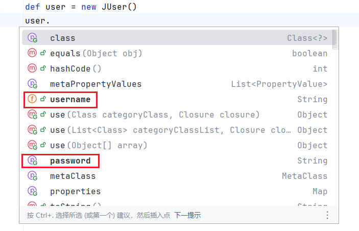
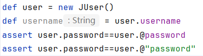

# 运算符

groovy运算符相比java有所增强。例如：指数运算`**`、操作符重载、安全运算操作符、空合并操作符等等。其操作性更强。

## 算数运算符

### 普通（二元）运算符
| 操作符 | 目的   | 评论                                                     |
| :----- | :----- | :------------------------------------------------------- |
| `+`    | 加法   |                                                          |
| `-`    | 减法   |                                                          |
| `*`    | 乘法   |                                                          |
| `/`    | 除法   | 相关特性请点击[整数除法](../syntax/base.md#div-calc)查看 |
| `%`    | 取余   |                                                          |
| `**`   | 幂运算 | 相关特性请点击[幂运算](../syntax/base.md#power-calc)查看 |

::: code-group


```groovy [main.groovy]
shell = new GroovyShell()
void pv(String value) {
    def res = shell.evaluate(value)
    println  "$value = $res(${res.getClass().getSimpleName()})"
}

pv "1+1"
pv "1+1f"
pv "1+1g"
pv "1+1.0g"
pv "1-1"
pv "1-1.0"
pv "1-1g"
pv "1*1"
pv "1*1.2"
pv "1/1"
pv "1/2"
pv "2/1"
pv "2%1"
pv "1**1"
pv "2**2"
pv "1.1**2"
pv "4**0.5"
pv "4.2**0.5"
```

```[打印结果]
1+1 = 2(Integer)
1+1f = 2.0(Double)
1+1g = 2(BigInteger)
1+1.0g = 2.0(BigDecimal)
1-1 = 0(Integer)
1-1.0 = 0.0(BigDecimal)
1-1g = 0(BigInteger)
1*1 = 1(Integer)
1*1.2 = 1.2(BigDecimal)
1/1 = 1(BigDecimal)
1/2 = 0.5(BigDecimal)
2/1 = 2(BigDecimal)
2%1 = 0(Integer)
1**1 = 1(Integer)
2**2 = 4(Integer)
1.1**2 = 1.21(BigDecimal)
4**0.5 = 2(Integer)
4.2**0.5 = 2.04939015319192(Double)
```


:::


### 一元运算符

简单来说就是带+负号数字或者++、--运算。运算逻辑与java相同

```groovy
def a=+1;
def b=-1;
def c=a++;
def d=b--;
def e=++a;
def f=--b;
```


### 赋值运算符

就是`+=`，`-=`等运算。与java相同，多出一个`**=`运算。

- `+=`
- `-=`
- `*=`
- `/=`
- `%=`
- `**=`

```groovy
def a=1;
a+=1;
a**=2; //a=a**2;
```

## 关系运算符

groovy关系运算在数值是表现差不多。在等于判断时

| 运算符 | 解释                                      |
| :----- | :---------------------------------------- |
| `==`   | 等于 相当于`equals()`                     |
| `!=`   | 不等于                                    |
| <      | 小于                                      |
| `<=`   | 小于或等于                                |
| `>`    | 大于                                      |
| `>=`   | 大于或等于                                |
| `===`  | 全等于（自 Groovy 3.0.0 起） 相当于`is()` |
| `!==`  | 不全等于（自 Groovy 3.0.0 起）            |


特别注意的是，groovy等等（`==`）不是java中的地址比较。而是被编码为`ScriptBytecodeAdapter.compareEqual(变量1，变量2)`

::: details ScriptBytecodeAdapter.compareEqual源码分析

```java
//ScriptBytecodeAdapter.compareEqual
public static boolean compareEqual(final Object left, final Object right) {
    if (left == right) return true;
    if (left != null && right != null) {
        Class leftClass = left.getClass();
        if (leftClass == right.getClass()) {
            if (leftClass == Integer.class) {
                return left.equals(right);
            }
            if (leftClass == BigDecimal.class) {
                return ((BigDecimal) left).compareTo((BigDecimal) right) == 0;
            }
            if (leftClass == BigInteger.class) {
                return ((BigInteger) left).compareTo((BigInteger) right) == 0;
            }
            if (leftClass == Long.class) {
                return left.equals(right);
            }
            if (leftClass == Double.class) {
                return left.equals(right);
            }
            if (leftClass == Float.class) {
                return left.equals(right);
            }
            if (leftClass == String.class) {
                return left.equals(right);
            }
            if (leftClass == GStringImpl.class) {
                return left.equals(right);
            }
        }
    }
    return DefaultTypeTransformation.compareEqual(left, right);
}
//DefaultTypeTransformation.compareEqual
public static boolean compareEqual(Object left, Object right) {
    if (left == right) return true;
    if (left == null) return right instanceof NullObject;
    if (right == null) return left instanceof NullObject;
    if (left instanceof Comparable) {
        return compareToWithEqualityCheck(left, right, true) == 0;
    }
    // handle arrays on both sides as special case for efficiency
    Class leftClass = left.getClass();
    Class rightClass = right.getClass();
    if (leftClass.isArray() && rightClass.isArray()) {
        return compareArrayEqual(left, right);
    }
    if (leftClass.isArray() && leftClass.getComponentType().isPrimitive()) {
        left = primitiveArrayToUnmodifiableList(left);
    }
    if (rightClass.isArray() && rightClass.getComponentType().isPrimitive()) {
        right = primitiveArrayToUnmodifiableList(right);
    }
    if (left instanceof Object[] && right instanceof List) {
        return DefaultGroovyMethods.equals((Object[]) left, (List) right);
    }
    if (left instanceof List && right instanceof Object[]) {
        return DefaultGroovyMethods.equals((List) left, (Object[]) right);
    }
    if (left instanceof List && right instanceof List) {
        return DefaultGroovyMethods.equals((List) left, (List) right);
    }
    if (left instanceof Map.Entry && right instanceof Map.Entry) {
        Object k1 = ((Map.Entry) left).getKey();
        Object k2 = ((Map.Entry) right).getKey();
        if (Objects.equals(k1, k2)) {
            Object v1 = ((Map.Entry) left).getValue();
            Object v2 = ((Map.Entry) right).getValue();
            return v1 == v2 || (v1 != null && DefaultTypeTransformation.compareEqual(v1, v2));
        }
        return false;
    }
    return (Boolean) InvokerHelper.invokeMethod(left, "equals", right);
}
```

观察上方代码

groovy会先判断是否是简单类型（`Integer、Long、Double`等 ）的判断，走简单逻辑。

如果都不是就会走复杂（数组，集合，Map）的类型的逻辑。如果都不是groovy处理的类型，就会走`equals`方法

:::


## 逻辑运算符

逻辑运算符：与`&&`或`||`非`!` 这些运算规则与java保持一致。

### 逻辑短路

逻辑短路就是 

- 或运算 第一个为true就直接返回true
- 与运算第一个为false就直接返回false

```groovy

res=false;

boolean setTrue(){
    res=true;
}
true || setTrue();
assert !res

res=false;
false || setTrue();
assert res;

res=false;
false && setTrue();
assert !res;

res=false;
true&&setTrue();
assert res;
```


## 位运算

groovy位运算与java一致

- `&`: 与运算 

  仅 1&1为1。
  
  <table >
      <tr>
          <td style="width:6em" >数字</td>
          <td style="width:6em">0</td>
          <td style="width:6em" >1</td>
      </tr>
      <tr>
          <td style="width:6em" >0</td>
          <td style="width:6em" >0</td>
          <td style="width:6em" >0</td>
      </tr>
      <tr>
          <td style="width:6em">1</td>
          <td style="width:6em">0</td>
          <td style="width:6em">1</td>
      </tr>
  </table>


- `|`: 或运算

  如果其中一个为1则为1。

  <table >
      <tr>
          <td style="width:6em" >数字</td>
          <td style="width:6em" >0</td>
          <td style="width:6em" >1</td>
      </tr>
      <tr>
          <td style="width:6em" >0</td>
          <td style="width:6em" >0</td>
          <td style="width:6em" >1</td>
      </tr>
      <tr>
          <td style="width:6em" >1</td>
          <td style="width:6em" >1</td>
          <td style="width:6em" >1</td>
      </tr>
  </table>

- `^`: 亦或运算 

  0^1 或者 1^0为1。

  <table >
      <tr>
          <td style="width:6em" >数字</td>
          <td style="width:6em" >0</td>
          <td style="width:6em" >1</td>
      </tr>
      <tr>
          <td style="width:6em" >0</td>
          <td style="width:6em" >0</td>
          <td style="width:6em" >1</td>
      </tr>
      <tr>
          <td style="width:6em" >1</td>
          <td style="width:6em" >1</td>
          <td style="width:6em" >0</td>
      </tr>
  </table>

- `~`: 非运算

  直接取反

计算机中运算是补码运算，为简化实验，实验中的数值采用正数，因为正数的补码是他本身。

```groovy
static def eq(def left, def right) {
    assert left == right
}

a = 0b10101010
b = 0b01010101
c = 0b11111111
d = 0b00000000

eq a & b, d
eq a & a, a
eq a | b, c
eq a | d, a
eq b | d, b
eq a ^ b, c
eq a ^ c, b
eq b ^ d, b
eq b ^ c, a
println Integer.toBinaryString(~d)
```

### 位移运算

groovy采用java相同的位移机制。但是groovy支持运算符重载。可自定义数据结构，然后重写方法。

```groovy
assert 16 == 2 << 3
assert  64 == 128 >>1
```


我们可以重载位移操作符达到我们需要的目的。集合类就是被重写了左移

::: code-group


```groovy [左移示例]
class Output {
    def leftShift(Object out) {
        System.out.print(out)
    }
}
def out=new Output();
out<<"666"
```

```groovy [右移示例]
class Input {
    def rightShift(build b) {
        Scanner scanner=new Scanner(System.in);
        def next = scanner.next()
        b.input(next)
    }
}
interface build{
    input(String value);
}
def input = new Input()
String str;
input>>(value->str=value) //java不允许赋值的，但是groovy允许，被转义成了set方法。
println str;
```

:::

## 条件运算符

### 取反(!)运算符

groovy中!取反。

```groovy
assert (!true)    == false                      
assert (!'str')   == false                      
assert (!'')      == true  
```

### 三目运算符

三元操作符如下

```groovy
def res= true?1:2;
```

#### Elvis 表达式

有时候，我们想如果不是空就为另外一个值。我们就靠三目运算符。

```groovy
res?res:"other"
```

我们可以省略res。

```groovy
res?:"other"
```

与js不同的是。js不是省略元素。是判断是否有效来说的。`0`，`""`算有效元素

::: code-group

```groovy [groovy]
""?:"other" //other
null?:"other" //other
"1"?:"other" //1
0?:1 //1
```

```js [js]
""??"other"//空字符串
null??"other" //other
undefined??"other" //other
0??2 //0
1??2 //1
```

:::

#### Elvis 赋值运算符。

如果用在赋值运算。可以使用`?=`进一步简化运算。

```groovy
res=0;
res?=2; //<=> res=res?:2 <=>res=res?res:2;
println res
```

## 对象运算符

### 安全导航运算符

groovy提供了和js(es2015)一样的安全导航运算符。使用?.来判断元素是否存在。

```groovy
class Obj{
    String file;
}
Obj obj=null;
print obj?.file
```

### 直接访问运算符

groovy中调用属性是优先采用getter来访问的。

对应如下java类：

```java

public class JUser {
    public String username;
    public String password="123456";

    public String getPassword() {
        System.out.println("我被访问了");
        return password;
    }
}
```

在groovy中访问两个元素有如下提示：



可以观察到，username显示是一个field。password显示是一个getter。但是在一些情况，我们想直接访问元素，我们可以使用`@`关键字来直达变量

```groovy
def user = new JUser()
def username = user.username
assert user.password==user.@password
assert user.password==user.@"password"
```

在idea中，属性特别显示紫色。




### 方法指针运算符

我们可以将对象的方法存起来（`.&`）。我们会得到一个闭包函数（Closure）然后稍后调用他。相当于回调函数。

```groovy
class People{
    def sayHello(){
        println "hello"
    }
    static void sayHello2(){
        println "hello2"
    }
}
def method=new People().&sayHello
method()
def method2=new People().&sayHello2
method2()
```


例如我们可以将一些库的方法，结构出来使用。比如这个计算器的add方法

```groovy
class Calculator {
    static int add(int a, b) {
        a + b;
    }
}
Closure<Integer> add = Calculator.&add
println add(1, 2)
println add(2, 3)
```

### 方法引用运算符

groovy 3+支持jdk8+的方法引用运算符。使用`变量::方法` 来传入方法

下列将List\<Integer\>转为String如下：

```groovy
Object array = [1, 2, 3]
        .stream()
        .map(String::valueOf)
        .toArray(String[]::new)// String[]::new <=> size->new String[size]
assert array instanceof String[]
```

使用方法引用简化了操作。


## 正则运算符

脚本在字符串的匹配，搜索是家常便饭。所以groovy简化了正则的操作。简化了正则的三个阶段 Pattern Matcher find

### Pattern运算符

这是一个一元操作符使用`~`作用在字符串上，就会产生一个Pattern对象。

```groovy
import java.util.regex.Pattern

def pattern= ~/a/;
assert pattern instanceof  Pattern
```

### Find 运算符

这是一个二元运算符`=~` ，使用 `输入=~正则字符串`来匹配字符串，产生一个Matcher对象。然后可以进行find操作来查询结果。

```groovy
import java.util.regex.Matcher

def matcher= "aaa"=~/a/
assert  matcher instanceof Matcher
```

groovy中matcher可以用来做判断条件的。

可点击 [Groovy Truth Matcher](../semantics/index#reg-matcher)进一步了解

find方法每次find会获得下一次匹配的内容。group返回的是当前匹配的组。

```groovy
def m= "ab" =~"(.)"
assert m;
assert m.group(0)=="a"
assert m
assert m.group(0)=="b"
```

#### Groovy中的Matcher

groovy对matcher进行了增强。

- 括号运算

  使用括号运算符会查找第几次结果，第几次的值。

  ```groovy
  def m= "ab" =~"(.)"
  assert m[0][0]=="a" // (.) 整体外层
  assert m[0][1]=="a" // (.) 分组内层的点
  assert m[1][0]=="b" // (.) 整体外层
  assert m[1][1]=="b" // (.) 分组内层的点
  ```

  ::: details StringGroovyMethods#getAt(java.util.regex.Matcher, int)

  ```groovy
  public static Object getAt(final Matcher self, int index) {
      try {
          int count = getCount(self);
          if (index < -count || index >= count) {
              throw new IndexOutOfBoundsException("index is out of range " + (-count) + ".." + (count - 1) + " (index = " + index + ")");
          }
          index = normaliseIndex(index, count);
          Iterator iter = iterator(self);
          Object result = null;
          for (int i = 0; i <= index; i++) {
              result = iter.next();
          }
          return result;
      }
      catch (IllegalStateException ex) {
          return null;
      }
  ```

  :::

- size方法

  返回匹配个数。

  ::: details StringGroovyMethods#size(java.util.regex.Matcher)

  ```groovy
  public static long size(final Matcher self) {
      return getCount(self);
  }
  public static int getCount(final Matcher self) {
      int counter = 0;
      self.reset(); //会被reset之后从头开始。
      while (self.find()) {
          counter += 1;
      }
      return counter;
  }
  ```

  :::

### Match 运算符

这是一个二元运算符`==~`，使用 `输入=~正则字符串`来匹配字符串，产生一个Boolean对象。用于**单精度匹配**。

```groovy
boolean  res= "a" ==~"a"//<=> "a".matches("a")
assert res;
def str="abc";
assert !(str==~"a")
assert str==~"abc" 
assert str==~/^abc$/
```


> [!TIP] Find运算符与Match 运算符的区别
>
> - Match 运算符用于单个精确匹配，属于全匹配。省略`^$`
>
> - Find运算符 用于查询多个结果用于模糊匹配。


## 其他运算符

### 扩展运算符

#### 数组对象的扩展

有时候我们想获取对象数据的某个字段，然后组成一个数组，我们最快的是使用Stream流来操作。

现在groovy提供了传播运算符，可以去对象数组的某个字段，组成数组。

```groovy
import java.util.stream.Stream

class User {
    String username;
    String getUsername() {
        return username
    }
    User(String username) {
        this.username = username
    }
}

def users = [new User("XM"), new User("XH")] as User[]
//java方法
List<String> jUsernameList = Stream.of(users).map(u->u.username).toList() //这里方法引用会被警告,暂时不理解，就直接使用lambda吧
//groovy方法
def gUsernameList = users*.username;
assert  jUsernameList==gUsernameList
```

可以使用数组封为最终结果。

```groovy
def usernameArr = users*.username as String[];
```

也可以直接使用list取。

```groovy
def usernameList = [new User("XM"), new User("XH")] *.username;
```

#### 方法的扩展


#### 列表的扩展


#### Map的扩展


### 范围运算符


### 比较运算符


### 下标[]运算符


### 安全索引运算符


### 成员判断运算符


### 全等()运算符

前面讲到===用来

### 转换操作符

groovy我们经常用到`as`转换为某个值。他其实内部是执行了asType方法。groovy帮我们实现了很多常用的转型。

```groovy
Integer i0= (Integer)'42' //报错，无法强转
Integer i= "42" as Integer
Integer[] is= [] as Integer[]
```

#### 自定义转型

我们可以通过重写类的asType方法实现实例的转型。

```groovy
class MP3 {

    String filename;

    Object asType(Class clazz) {
        if (clazz == WAV) {
            def wav = new WAV()
            wav.filename=filename;
            return wav;
        }
        throw  new ClassCastException("MP3 无法转为 $clazz")
    }
}

class WAV {
    String filename;
    Object asType(Class clazz) {
        if (clazz == MP3) {
            def mp3 = new MP3()
            mp3.filename=filename;
            return mp3

        }
        throw   new ClassCastException("WAV 无法转为 $clazz")
    }
}

def mp3 = new MP3()
mp3.filename="aaa"
def wav = mp3 as WAV
assert wav.filename==mp3.filename
```

### 钻石操作符

也就是泛型

```groovy
List<String> arr=new ArrayList<>()
```

### 方法调用运算符

诚然，在java中方法就是方法，对象就是对象。groovy支持call()重载，实现对象的调用。

```groovy
import java.util.stream.Stream

class Add{
    //static可加可不加
    static int call(int a, int b){
        return a+b;
    }
    static int call(int...nums){
        def integers = nums as Integer[] //不能直接传，groovy无法自动装箱，可能是bug
        return Stream.of(integers).mapToInt(i->i).sum();
    }
    static int call(List<Integer> nums){
        return nums.stream().mapToInt(i->i).sum();
    }
}
def add = new Add()
println add(1, 2)
println add(1, 2,3)
def of = List.of(1, 2, 3)
println add(of)
//println Add(1, 2) //报错找不到方法
```

## 操作符优先级

| 等级 | 操作人员                                                     | 姓名                                                         |
| :--- | :----------------------------------------------------------- | :----------------------------------------------------------- |
| 1    | `new`  `()`                                                  | 对象创建，显式括号                                           |
|      | `()`  `{}`  `[]`                                             | 方法调用、闭包、下标运算                                     |
|      | `.`  `.&`  `.@`                                              | 成员访问、方法闭包、字段/属性访问                            |
|      | `?.`  `*`  `*.`  `*:`                                        | 安全解除引用、扩展、扩展点、扩展图                           |
|      | `~`  `!`  `(type)`                                           | 按位取反/模式，非，类型转换                                  |
|      | `[]`  `?[]`  `++`  `--`                                      | 列表/映射/数组（安全）索引，后增/减                          |
| 2    | `**`                                                         | 求幂                                                         |
| 3    | `+` `--`  `-`                                                | 预增加/减少，一元加法，一元减法                              |
| 4    | `*`  `/`  `%`                                                | 乘、除、余数                                                 |
| 5    | `+`  `-`                                                     | 加法、减法                                                   |
| 6    | `<<`  `>>`  `>>>`  `..`  `..<`  `<..<`  `<..`                | 左/右（无符号）移位，包含/排除范围                           |
| 7    | `<`  `<=`  `>`  `>=`  `in`  `!in`  `instanceof`  `!instanceof`  `as` | 小于/大于/或等于、在、不在、instanceof、非instanceof、类型强制 |
| 8    | `==`  `!=`  `<=>`  `===`  `!==`                              | 等于、不等于、比较、相同、不相同                             |
|      | `=~`  `==~`                                                  | 正则表达式查找，正则表达式匹配                               |
| 9    | `&`                                                          | 二进制/按位与                                                |
| 10   | `^`                                                          | 二进制/按位异或                                              |
| 11   | `|`                                                          | 二进制/按位或                                                |
| 12   | `&&`                                                         | 逻辑和                                                       |
| 13   | `||`                                                         | 逻辑或                                                       |
| 14   | `? :`                                                        | 三元条件                                                     |
|      | `?:`                                                         | elvis 运算符                                                 |
| 15   | `=`  `**=`  `*=`  `/=`  `%=`  `+=`  `-=`  `<<=`  `>>=`  `>>>=`  `&=`  `^=`  `|=`   `?=` | 赋值运算                                                     |

## 运算符重载

java不支持运算符重载，目的是减少意外的运算导致可阅读性降低，但是也减少了其可扩展性。

groovy有一个好处就是支持运算符重载，可以重载常用的操作符达到自定义我们数据结构的目的。

| 运算符 | 方法          | 运算符     | 方法                    |
| :----- | :------------ | :--------- | :---------------------- |
| `+`    | a.plus(b)     | `a[b]`     | a.getAt(b)              |
| `-`    | a.minus(b)    | `a[b] = c` | a.putAt(b, c)           |
| `*`    | a.multiply(b) | `a in b`   | b.isCase(a)             |
| `/`    | a.div(b)      | `<<`       | a.leftShift(b)          |
| `%`    | a.mod(b)      | `>>`       | a.rightShift(b)         |
| `**`   | a.power(b)    | `>>>`      | a.rightShiftUnsigned(b) |
| `|`    | a.or(b)       | `++`       | a.next()                |
| `&`    | a.and(b)      | `--`       | a.previous()            |
| `^`    | a.xor(b)      | `+a`       | a.positive()            |
| `as`   | a.asType(b)   | `-a`       | a.negative()            |
| `a()`  | a.call()      | `~a`       | a.bitwiseNegate()       |

下列举例一个复数运算

实现了加法和乘法，后续可以实现除法和减法

```groovy
class Complex {

    BigDecimal a;
    BigDecimal b;

    Complex(BigDecimal a, BigDecimal b) {
        this.a = a
        this.b = b
    }
    String toString() {
        return "${a?a.stripTrailingZeros():""}${a*b!=0&&b>0?"+":""}${b?b.stripTrailingZeros()+"i":""}"
    }
    Complex plus(Complex other) {
        def complex = new Complex(0.0g,0.0g)
        complex.a = a + other.a
        complex.b = b + other.b
        return complex
    }
    Complex multiply(Complex other){
        def complex = new Complex(0.0g,0.0g)
        complex.a = a * other.a -b*other.b
        complex.b= a*other.b+b*other.a
        return complex;
    }
}

def c1 = new Complex(1.0g, 1.0g)
def c2 = new Complex(1.0g, 1.0g)
def c3 = new Complex(1.0g, -1.0g)
println c1+c2
println c1*c2
println c1*c3
```
