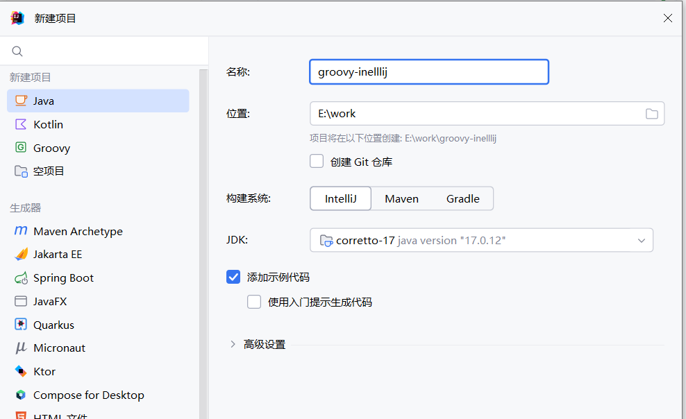
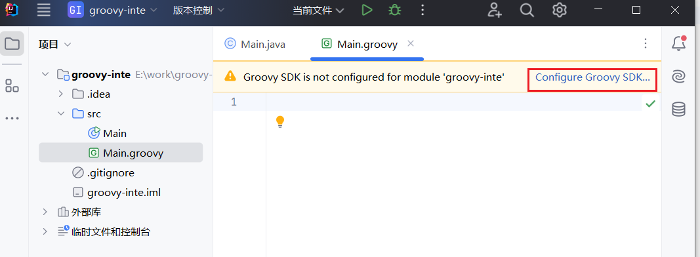
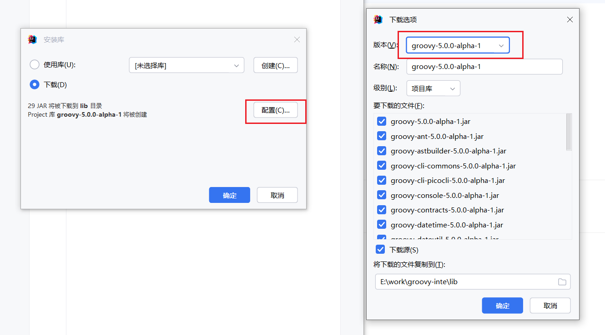
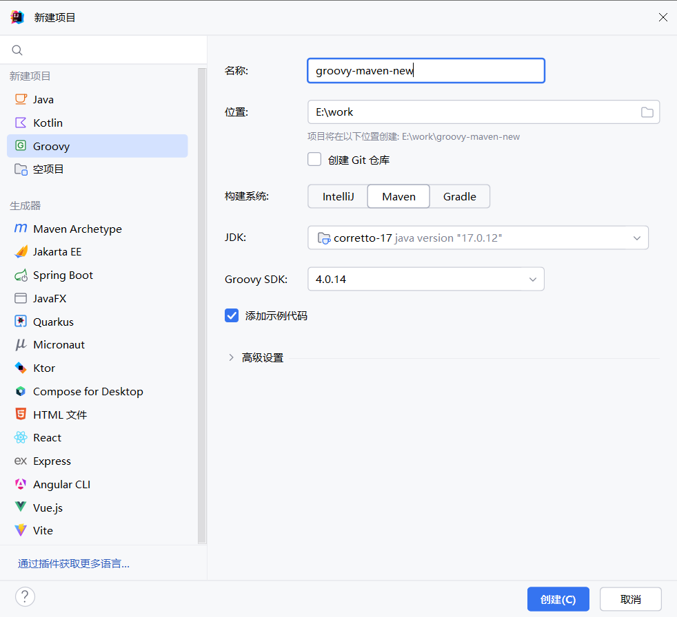
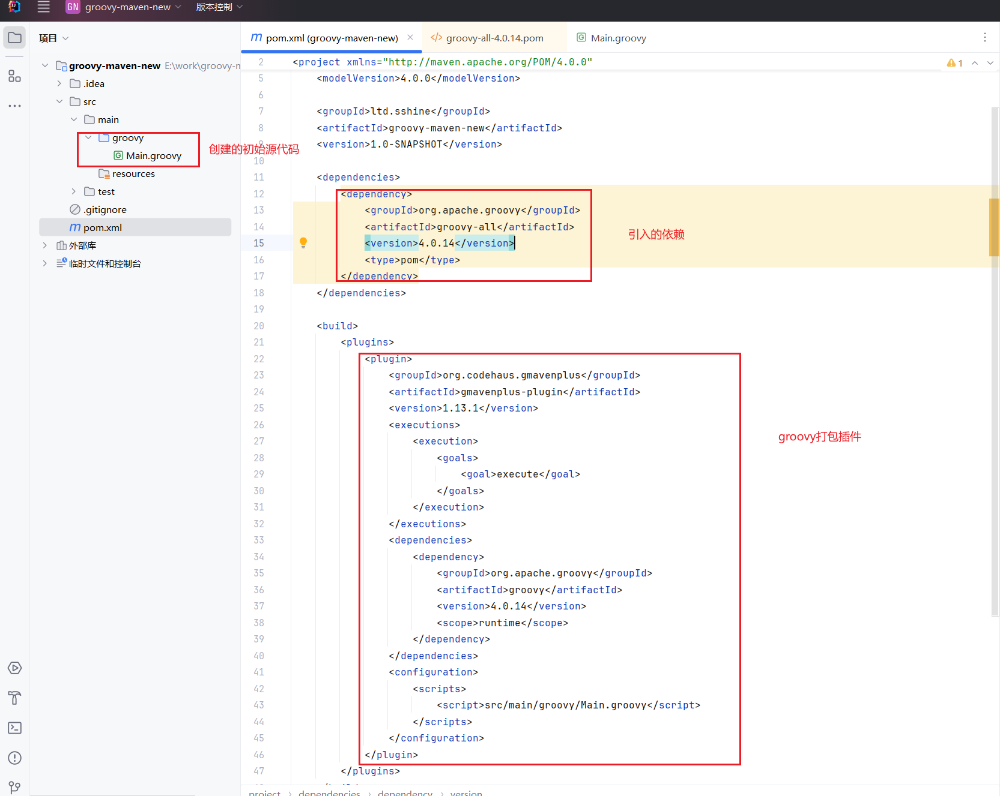
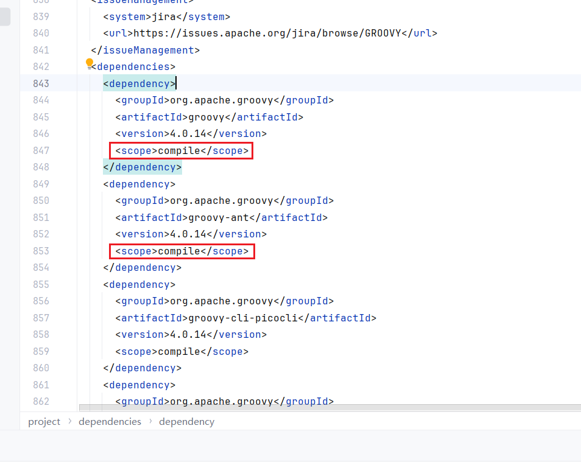
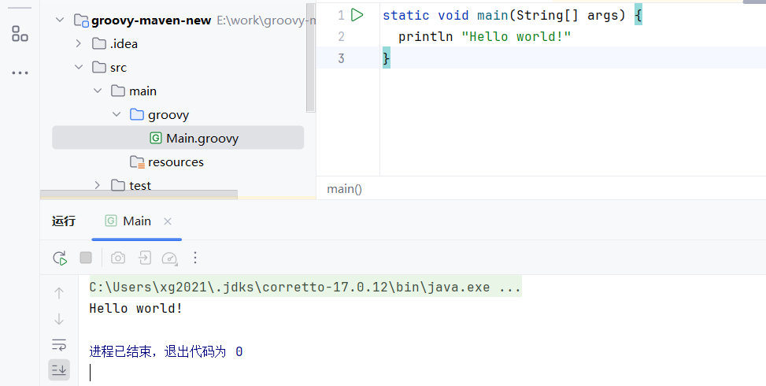
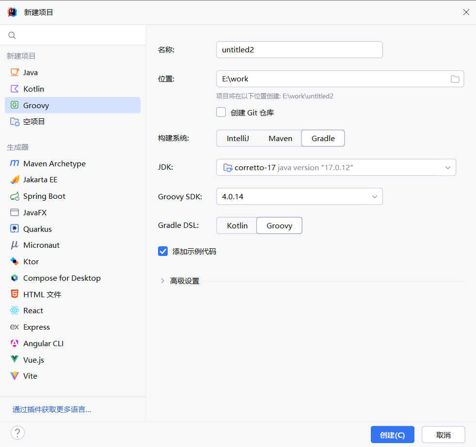
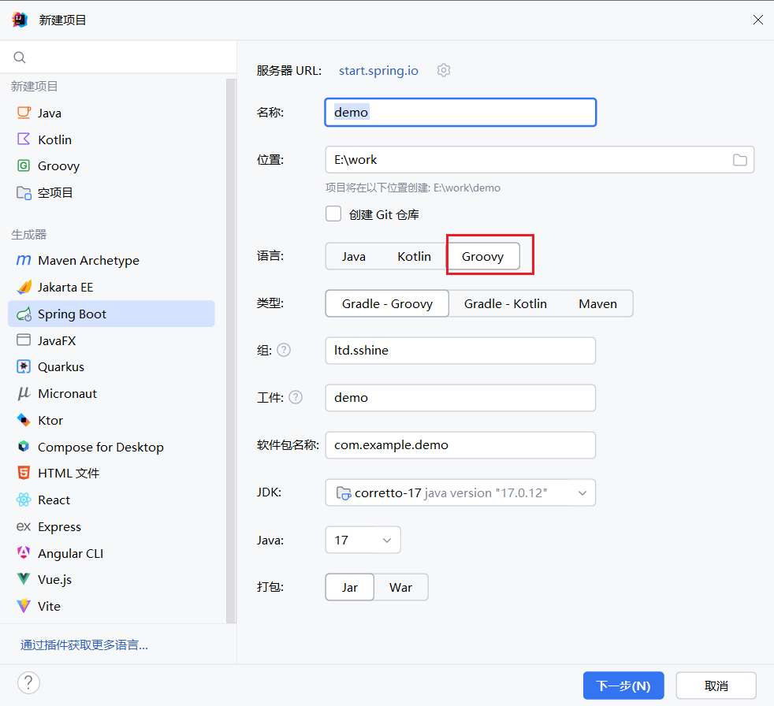

# 在项目中使用Groovy

有时候我们想用Groovy开快速开发应用，但是一般的maven项目并不原生支持。

## 在普通项目中使用

在普通Java模块项目时，即让idea来管理我们的依赖



idea会自动讲Groovy放到模块的lib内，当你新建一个Groovy文件后idea会推荐你配置Groovy SDK 



然后点击配置选择合适的版本。



## 在Maven项目中使用

我们可以使用[Maven插件](https://github.com/groovy/GMavenPlus/wiki/Examples#groovy-maven-plugins)来实现

### 新建Groovy Maven项目

我们可以之间用idea帮我们创建，然后初始化模板。



创建完成后，他会帮我们引入`groovy-all`依赖，然后使用gplus插件帮我们编译Groovy代码。



点开pom文件，可以看到是compile的依赖，会被打包进系统



点击运行，我们就跑起来了




### 在中途使用Groovy（混合编程）

如果我们项目已经成型，比如我们在Spring Boot中引入。我们也可以按相同的道理，引入Groovy依赖，然后配置插件就可。

Spring Boot已帮我们包含了Groovy的版本号

::: details 关键pom.xml

```xml
    <dependencies>
        <dependency>
            <groupId>org.apache.groovy</groupId>
            <artifactId>groovy</artifactId>
        </dependency>
    </dependencies>

    <build>
        <plugins>
            <plugin>
                <groupId>org.codehaus.gmavenplus</groupId>
                <artifactId>gmavenplus-plugin</artifactId>
                <version>1.13.1</version>
                <executions>
                    <execution>
                        <goals>
                            <goal>addSources</goal>
                            <goal>addTestSources</goal>
                            <goal>generateStubs</goal>
                            <goal>compile</goal>
                            <goal>generateTestStubs</goal>
                            <goal>compileTests</goal>
                            <goal>removeStubs</goal>
                            <goal>removeTestStubs</goal>
                        </goals>
                    </execution>
                </executions>
            </plugin>
        </plugins>
    </build>
```

:::

## 在Gradle项目中使用

因为Gradle原生支持Groovy，使用Froovy的DSL来声明依赖，所以Gradle是有Groovy库的，使用Groovy创建较为简易。

### 新建Gradle Groovy项目

在idea中创建Groovy，选择Gradle管理



可以看到代码关键代码只有两行

```groovy
plugins {
    id 'groovy'
}
dependencies {
    implementation 'org.apache.groovy:groovy:4.0.14'
}
```

### 在中途使用Groovy（混合编程）

直接添加上述代码即可

```groovy
plugins {
    id 'groovy'
}
dependencies {
    implementation 'org.apache.groovy:groovy:4.0.14'
}
```

## Spring Boot中直接创建

目前，最新的idea支持创建groovy的springboot程序。我们可以一键生成groovy的springboot

