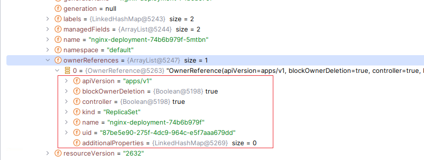
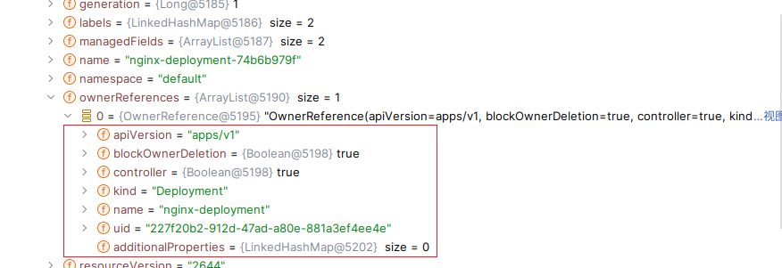
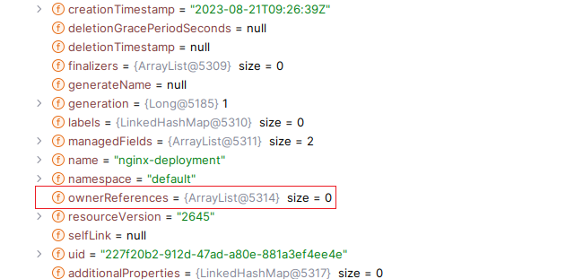

# k8s对象

### 什么是k8s对象？

在 Kubernetes 系统中，**Kubernetes 对象**是持久化的实体。 Kubernetes 使用这些实体去表示整个集群的状态。

#### 理解k8s对象

k8s对象描述了下列信息：

- 哪些容器化应用正在运行（以及在哪些节点上运行）
- 可以被应用使用的资源
- 关于应用运行时行为的策略，比如重启策略、升级策略以及容错策略

k8s对象是一种意向表达，一旦创建该对象，k8s系统将不断确保该对象存在。通过创建对象，本质上在告知系统，工作负载应该是什么样子的。k8s就会不断的向期望状态上靠。

而k8s对象的操作无疑是创建修改删除--需要使用k8s api。而kubectl会调用k8s api来操作。

也可以使用[k8s的客户端](https://kubernetes.io/zh-cn/docs/reference/using-api/client-libraries/)

### 对象规约（Spec）与状态（Status）

几乎每个 Kubernetes 对象包含两个嵌套的对象字段，它们负责管理对象的配置： 对象 **`spec`（规约）** 和对象 **`status`（状态）**。

`spec` ：描述了对象期望的状态

`status`：描述了对象的当前状态

k8s中，Deployment 对象能够表示运行在集群中的应用。 如果原来副本为3，有一个副本因为某种原因，停止了。k8s就会重新启动pod以重新达到期望状态。


### 对象描述

k8s对象使用yaml或json。yaml最终被转成json。

下面是一个nginx的对象描述,使用Deployment进行描述（至于pod和Deployment，请看工作负载）

```yaml
apiVersion: apps/v1
kind: Deployment
metadata:
  name: nginx-deployment
spec:
  selector:
    matchLabels:
      app: nginx
  replicas: 2 # 告知 Deployment 运行 2 个与该模板匹配的 Pod
  template:
    metadata:
      labels:
        app: nginx
    spec:
      containers:
      - name: nginx
        image: nginx:1.14.2
        ports:
        - containerPort: 80
```


更对对象描述请打开<a href="./k8s配置文件.md"> k8s文件配置</a>

### 对象管理（kubectl）

阅读此篇，需要先懂k8s对象api


k8s对象管理通常使用kubectl，显然可以使用客户端。

k8s对象的管理有三种方式

| 管理技术       | 作用于   | 建议的环境 | 支持的写者 | 学习难度 |
| -------------- | -------- | ---------- | ---------- | -------- |
| 指令式命令     | 活跃对象 | 开发项目   | 1+         | 最低     |
| 指令式对象配置 | 单个文件 | 生产项目   | 1          | 中等     |
| 声明式对象配置 | 文件目录 | 生产项目   | 1+         | 最高     |

#### 指令式命令

语法

```shell
 kubectl create deployment NAME --image=image  [options] -- [COMMAND] [args...]
```

-- [COMMAND] [args...] 这串是可选的

参数

```shell
--allow-missing-template-keys=true:
    If true, ignore any errors in templates when a field or map key is missing in the
    template. Only applies to golang and jsonpath output formats.

--dry-run='none':
    Must be "none", "server", or "client". If client strategy, only print the object that
    would be sent, without sending it. If server strategy, submit server-side request without
    persisting the resource.

--field-manager='kubectl-create':
    Name of the manager used to track field ownership.

--image=[]:
    Image names to run.

-o, --output='':
    Output format. One of: (json, yaml, name, go-template, go-template-file, template,
    templatefile, jsonpath, jsonpath-as-json, jsonpath-file).

--port=-1:
    The port that this container exposes.

-r, --replicas=1:
    Number of replicas to create. Default is 1.

--save-config=false:
    If true, the configuration of current object will be saved in its annotation. Otherwise,
    the annotation will be unchanged. This flag is useful when you want to perform kubectl
    apply on this object in the future.

--show-managed-fields=false:
    If true, keep the managedFields when printing objects in JSON or YAML format.

--template='':
    Template string or path to template file to use when -o=go-template, -o=go-template-file.
    The template format is golang templates
    [http://golang.org/pkg/text/template/#pkg-overview].

--validate='strict':
    Must be one of: strict (or true), warn, ignore (or false).              "true" or "strict" will use a
    schema to validate the input and fail the request if invalid. It will perform server side
    validation if ServerSideFieldValidation is enabled on the api-server, but will fall back
    to less reliable client-side validation if not.                 "warn" will warn about unknown or
    duplicate fields without blocking the request if server-side field validation is enabled
    on the API server, and behave as "ignore" otherwise.            "false" or "ignore" will not
    perform any schema validation, silently dropping any unknown or duplicate fields.
```

例如:创建一个nginx 名字叫nginx-demo，副本为2

```shell
 kubectl create deployment nginx-demo --image=nginx  --replicas=2
```


权衡：

与对象配置相比的优点：

- 命令用单个动词表示。
- 命令仅需一步即可对集群进行更改。

与对象配置相比的缺点：

- 命令不与变更审查流程集成。
- 命令不提供与更改关联的审核跟踪。
- 除了实时内容外，命令不提供记录源。
- 命令不提供用于创建新对象的模板。

#### 指令式对象配置

指令式对象配置可以更加复杂的管理对象，并且可以设置复杂模板。

编写好yaml的k8s对象后

使用create创建对象

```shell
kubectl create -f nginx.yaml
```

若多个可以随后

```shell
kubectl delete -f nginx.yaml -f redis.yaml
```

下面的也同理

使用delete删除对象

```shell
kubectl delete -f nginx.yaml
```

使用replace替换对象

```shell
kubectl replace -f nginx.yaml
```


权衡：

增加了复杂性：配置可以更复杂的配置对象，对开发者要求增加

可持久化对象：持久化k8s对象，提高了复用性,可以被Git管理

#### 声明式对象配置

声明式可以更新对象的修改，保存在k8s的etcd存储系统中。

声明式支持文件夹和文件，可批量创建集群。

diff可以查看命令(可选)

```shell
kubectl diff -f configs/
```

检查无误后就可以执行apply进行新增或更新

```shell
kubectl apply -f configs/
```

删除

```shell
kubectl delete -f configs/
```

获取yaml配置

```shell
kubectl get 对象类型 对象名称 -o yaml
```

修改副本

```shell
kubectl scale 对象类型/对象名称 --replicas=2
```


权衡：

- 对活动对象所做的更改即使未合并到配置文件中，也会被保留下来。

  更新了对象，未写入配置文件中。

- 声明性对象配置更好地支持对目录进行操作并自动检测每个文件的操作类型（创建，修补，删除）

  更好的识别添加和修改

- 使用 diff 产生的部分更新会创建复杂的合并和补丁操作。

- 调试困难


### 对象名称和对象ID

 API 资源通过各自的 API 组、资源类型、名字空间（对于划分名字空间的资源）和名称来区分。k8s对象在类型中具有唯一性

比如：pod中只能有一个 my-pod，deployment可以是my-pod

对于非唯一属性使用标签属性


#### UID

Kubernetes 系统生成的字符串，唯一标识对象。在 Kubernetes 集群的整个生命周期中创建的每个对象都有一个不同的 UID，它旨在区分类似实体的历史事件。


#### 命名约束

以下是常见的4种命名约束

##### DNS 子域名

例如：在 `example.com` 域名下创建的 `www.example.com` 子域名，`blog.example.com` 子域名，`mail.example.com` 子域名等都是 DNS 子域名。

DNS 子域名的定义可参见 [RFC 1123](https://tools.ietf.org/html/rfc1123)

名称必须满足如下规则：

- 不能超过 253 个字符
- 只能包含小写字母、数字，以及 '-' 和 '.'
- 必须以字母数字开头
- 必须以字母数字结尾

例如：


Service：`my-service.default.svc.cluster.local`

Pod：`my-pod-1234.default.pod.cluster.local`

Deployment：`my-deployment.default.svc.cluster.local`

ReplicaSet：`my-replicaset.default.svc.cluster.local`

StatefulSet：`my-statefulset.default.svc.cluster.local`

Ingress：`my-ingress.default.svc.cluster.local`

##### RFC 1123 标签名

某些资源类型需要其名称遵循 [RFC 1123](https://tools.ietf.org/html/rfc1123) 所定义的 DNS 标签标准。也就是命名必须满足如下规则：

- 最多 63 个字符
- 只能包含小写字母、数字，以及 '-'
- 必须以字母数字开头
- 必须以字母数字结尾

例如：

- ConfigMap：`my-config-map`
- Secret：`my-secret`
- PersistentVolume：`my-pv`
- Namespace：`my-namespace`
- ServiceAccount：`my-service-account`
- Role：`my-role`
- ClusterRole：`my-cluster-role`
- RoleBinding：`my-role-binding`
- ClusterRoleBinding：`my-cluster-role-binding`


##### RFC 1035 标签名

- 最多 63 个字符
- 只能包含小写字母、数字，以及 '-'
- 必须以字母开头
- 必须以字母数字结尾

例如：

- StatefulSet：`my-statefulset`
- Service：`my-service`
- Endpoints：`my-service-endpoints`
- Secret：`my-secret`
- ConfigMap：`my-configmap`

##### 路径分段名称

某些资源类型要求名称能被安全地用作路径中的片段。 换句话说，其名称不能是 `.`、`..`，也不可以包含 `/` 或 `%` 这些字符。

例如：不是my.namespace

**选择适合自己团队和应用程序的 Namespace 命名规范是很重要的。建议团队在制定命名规范时，考虑到可读性、可理解性、兼容性和可扩展性等方面，并确保全团队都能遵循这些规范。**


### 标签和选择算符

#### **标签（Labels）**

标签是附加到 Kubernetes 对象（比如 Pod）上的键值对。 标签旨在用于指定对用户有意义且相关的对象的标识属性，但不直接对核心系统有语义含义。 

使用标签，可以快速查询和监听。

在metadata下编写

```yaml
metadata:
  labels:
    k1: v1
    k2: v2
```

例如下面nginx

```yaml
apiVersion: apps/v1
kind: Deployment
metadata:
  name: nginx
  labels:
    app: nginx-dep
spec:
  replicas: 3
  selector:
    matchLabels:
      app: nginx
  template:
    metadata:
      labels:
        app: nginx
    spec:
      containers:
        - name: nginx
          image:  nginx:1.16.1
          ports:
            - containerPort: 80
```

可以通过标签匹配来得到结果

```shell
kubectl get 资源 -l 条件1,条件2,...
```

通过下列语句可以查询到dep

```shell
k8s@VM-12-7-ubuntu:~/deployments$ kubectl get deployment -l app=nginx-dep
NAME    READY   UP-TO-DATE   AVAILABLE   AGE
nginx   3/3     3            3           2m22s
```

使用nginx可以查询pod

```shell
k8s@VM-12-7-ubuntu:~/deployments$ kubectl get pod -l app=nginx
NAME                    READY   STATUS    RESTARTS   AGE
nginx-74b6b979f-b4n94   1/1     Running   0          4m15s
nginx-74b6b979f-bdn5f   1/1     Running   0          4m15s
nginx-74b6b979f-d7gl4   1/1     Running   0          4m15s
```


运算类型

- 等值 = 等于,== 等于,!= 不等于

  ```txt
  environment = production
  environment == production
  tier != frontend
  ```

- 集合 in存在于，notin 不存在于，exists 存在

  ```
  environment in (production, qa) 
  tier notin (frontend, backend)
  partition #包含partition标签
  !partition #不否包含partition标签
  ```


#### **选择运算符**

通过标签，使用选择运算，我们可以非常方便的匹配我们需要的**工作负载**和**节点**

也可以实现，将pod放到指定节点运行。

可以通过api和kubectl实现查询

```shell
kubectl get pods -l app=nginx
```

若含空格使用冒号

```shell
kubectl get pods -l 'app in (nginx)'
```


#### **selector**

用于工作负载对pod的选择。selector会匹配对应的节点，然后进行统一管理

对于下面service配置，下列配置会匹配 **pod**的标签上有 app:nginx的情况

```yaml
apiVersion: v1
kind: Service
metadata:
  name: nginx-service
spec:
  selector:
    app: nginx
```

比较新的资源，例如 `Job`、`Deployment`、 `ReplicaSet` 和 `DaemonSet`， 也支持**基于集合的**需求。

可以支持多个匹配：（没什么用。。。一个template必须在上面。。。，还有什么意思呢？）

以下对象保留关键因素

```yaml
apiVersion: apps/v1
kind: Deployment
metadata:
  name: nginx
  labels:
    app: nginx-dep
spec:
  template:
    metadata:
      labels:
        app: nginx
  selector:
    matchLabels:
      app: nginx
    matchExpressions:
      - key: app
        operator: In
        values:
          - nginx
```

matchLabels：匹配标签，

matchExpressions：提供复杂的匹配操作

#### [选择器与pod委派](../scheduling-eviction/选择器与pod委派.md)

我们可以根据标签，将pod部署到符合条件的节点上


### 命名空间

在k8s中，使用命名空间将同一集群中的资源划分为相互隔离的组。

名字空间为名称提供了一个范围。资源的名称需要在名字空间内是唯一的，但不能跨名字空间。 名字空间不能相互嵌套，每个 Kubernetes 资源只能在一个名字空间中。

#### 使用场景

适用于存在多个团队或项目的用户场景，几到几十个用户的集群，还不需要考虑。

不要使用命名空间来区分细微不同的资源，例如版本（可以使用标签区分）


#### 自带命名空间

k8s自带命名空间，初始创建如下4个命名空间

- default

  未指定命名空间的对象会设置为default

- kube-node-lease

  用于管理节点租约的命名空间。它用于节点心跳、健康检查、故障检测以及节点之间的协调和互斥。这个命名空间是由 Kubernetes 自动创建和管理的，通常不需要用户干预或直接操作。

- kube-public

  **所有**的客户端（包括未经身份验证的客户端）都可以读取该名字空间。可用于集群广播，集群存储（CA证书）等服务

- kube-system

  k8s系统创建的对象

::: tip 提示

我们应该尽量避免使用kube-开头的对象，因为这个用于k8s系统保留

:::


#### 如何使用


查看命名空间

```shell
kubectl get namespace
```

结果

```txt
k8s@VM-12-7-ubuntu:~$ kubectl get namespace
NAME                   STATUS   AGE
default                Active   18d
kube-node-lease        Active   18d
kube-public            Active   18d
kube-system            Active   18d
kubernetes-dashboard   Active   18d
```


创建命名空间

```shell
kubectl create namespace <namespace-name>
```

结果

```txt
k8s@VM-12-7-ubuntu:~$ kubectl create namespace test
namespace/test created
k8s@VM-12-7-ubuntu:~$ kubectl get namespace
NAME                   STATUS   AGE
default                Active   18d
kube-node-lease        Active   18d
kube-public            Active   18d
kube-system            Active   18d
kubernetes-dashboard   Active   18d
test                   Active   3s
```

为请求设置名字空间

我们可以为请求指定命名空间，可以在指定命名空间查询或者创建。

例如

```shell
kubectl create deployment nginx-demo --image=nginx --namespace=<命名空间>  --replicas=2
kubectl get pods --namespace=<命名空间>
```

在配置文件中，使用元数据（`metadata.namespace`）配置命名空间


删除命名空间

```shell
kubectl delete namespaces <命名空间>
```

这个命令会将命名空间下的资源**都删除**


#### 名字空间和 DNS

当我们创建一个服务时，k8s会自动创建一个dns条目，该条目是`<服务名称>.<名字空间名称>.svc.cluster.local` .也叫**完全限定域名（FQDN）**。同一个命名空间中的容器，使用`<服务名称>`即可访问。这样子对于各个环境（开发，测试，生产）非常有用。

如果要跨命名空间需要使用**完全限定名（FQDN）**

所以，名字空间名称都遵循  <a href="#rfc-1123-标签名">RFC 1123 DNS 标签</a>


#### 并非所有对象都在命名空间中

大多数 kubernetes 资源（例如 Pod、Service、Deployment控制器等）都位于某些名字空间中。而一些资源（例如：节点，持久化卷）就不存在与命名空间中。

使用下列语句可以查看该资源是否在命名空间中

```shell
# 位于名字空间中的资源
kubectl api-resources --namespaced=true

# 不在名字空间中的资源
kubectl api-resources --namespaced=false
```

结果

```txt
k8s@VM-12-7-ubuntu:~$ kubectl api-resources --namespaced=true
NAME                        SHORTNAMES   APIVERSION                     NAMESPACED   KIND
bindings                                 v1                             true         Binding
configmaps                  cm           v1                             true         ConfigMap
endpoints                   ep           v1                             true         Endpoints
events                      ev           v1                             true         Event
limitranges                 limits       v1                             true         LimitRange
persistentvolumeclaims      pvc          v1                             true         PersistentVolumeClaim
pods                        po           v1                             true         Pod
podtemplates                             v1                             true         PodTemplate
replicationcontrollers      rc           v1                             true         ReplicationController
resourcequotas              quota        v1                             true         ResourceQuota
secrets                                  v1                             true         Secret
serviceaccounts             sa           v1                             true         ServiceAccount
services                    svc          v1                             true         Service
controllerrevisions                      apps/v1                        true         ControllerRevision
daemonsets                  ds           apps/v1                        true         DaemonSet
deployments                 deploy       apps/v1                        true         Deployment
replicasets                 rs           apps/v1                        true         ReplicaSet
statefulsets                sts          apps/v1                        true         StatefulSet
localsubjectaccessreviews                authorization.k8s.io/v1        true         LocalSubjectAccessReview
horizontalpodautoscalers    hpa          autoscaling/v2                 true         HorizontalPodAutoscaler
cronjobs                    cj           batch/v1                       true         CronJob
jobs                                     batch/v1                       true         Job
leases                                   coordination.k8s.io/v1         true         Lease
endpointslices                           discovery.k8s.io/v1            true         EndpointSlice
events                      ev           events.k8s.io/v1               true         Event
ingresses                   ing          networking.k8s.io/v1           true         Ingress
networkpolicies             netpol       networking.k8s.io/v1           true         NetworkPolicy
poddisruptionbudgets        pdb          policy/v1                      true         PodDisruptionBudget
rolebindings                             rbac.authorization.k8s.io/v1   true         RoleBinding
roles                                    rbac.authorization.k8s.io/v1   true         Role
csistoragecapacities                     storage.k8s.io/v1              true         CSIStorageCapacity
k8s@VM-12-7-ubuntu:~$ kubectl api-resources --namespaced=false
NAME                              SHORTNAMES   APIVERSION                             NAMESPACED   KIND
componentstatuses                 cs           v1                                     false        ComponentStatus
namespaces                        ns           v1                                     false        Namespace
nodes                             no           v1                                     false        Node
persistentvolumes                 pv           v1                                     false        PersistentVolume
mutatingwebhookconfigurations                  admissionregistration.k8s.io/v1        false        MutatingWebhookConfiguration
validatingwebhookconfigurations                admissionregistration.k8s.io/v1        false        ValidatingWebhookConfiguration
customresourcedefinitions         crd,crds     apiextensions.k8s.io/v1                false        CustomResourceDefinition
apiservices                                    apiregistration.k8s.io/v1              false        APIService
tokenreviews                                   authentication.k8s.io/v1               false        TokenReview
selfsubjectaccessreviews                       authorization.k8s.io/v1                false        SelfSubjectAccessReview
selfsubjectrulesreviews                        authorization.k8s.io/v1                false        SelfSubjectRulesReview
subjectaccessreviews                           authorization.k8s.io/v1                false        SubjectAccessReview
certificatesigningrequests        csr          certificates.k8s.io/v1                 false        CertificateSigningRequest
flowschemas                                    flowcontrol.apiserver.k8s.io/v1beta3   false        FlowSchema
prioritylevelconfigurations                    flowcontrol.apiserver.k8s.io/v1beta3   false        PriorityLevelConfiguration
ingressclasses                                 networking.k8s.io/v1                   false        IngressClass
runtimeclasses                                 node.k8s.io/v1                         false        RuntimeClass
clusterrolebindings                            rbac.authorization.k8s.io/v1           false        ClusterRoleBinding
clusterroles                                   rbac.authorization.k8s.io/v1           false        ClusterRole
priorityclasses                   pc           scheduling.k8s.io/v1                   false        PriorityClass
csidrivers                                     storage.k8s.io/v1                      false        CSIDriver
csinodes                                       storage.k8s.io/v1                      false        CSINode
storageclasses                    sc           storage.k8s.io/v1                      false        StorageClass
volumeattachments                              storage.k8s.io/v1                      false        VolumeAttachment

```


#### 自动打标签

k8s会默认给命名空间添加一个` kubernetes.io/metadata.name`=<命名空间>的标签

例如：执行`kubectl create namespace test` 后得

```txt
k8s@VM-12-7-ubuntu:~$ kubectl  describe namespace test
Name:         test
Labels:       kubernetes.io/metadata.name=test
Annotations:  <none>
Status:       Active

No resource quota.

No LimitRange resource.
```

### 注解

你可以使用 Kubernetes 注解为**对象**附加任意的非标识的元数据。 **客户端程序**（例如工具和库）能够获取这些元数据信息。与k8s系统没有关联的数据

**注意**：注解不会被k8s系统处理，只会给应用程序或客户端进行，处理，所以不会**提供高效的查询和匹配**功能。


对于注解，元数据可以很小也可以很大，也可以非结构化，能够包含标签不允许的字符，但是**键值**都必须为**字符串**。


使用

```yaml
metadata:
  annotations:
    key1: 'value1'
    key2: 'value2'
```


注解的使用例子

- 声明性字段
- 构建发布信息
- 负责人和团队信息，例如电话，网站，发布者姓名，邮箱等等
- 复杂的配置

这样做就使得开发人员便于生成用于部署、管理、自检的客户端共享库和工具。

#### 语法和字符集

注解的使用，名称需要遵循以下规则

格式：前缀/名称

前缀是可选的，前缀和名称使用`/`进行分割

-  名称段是必需项，并且必须在 63 个字符以内，以字母数字字符（`[a-z0-9A-Z]`）开头和结尾， 并允许使用破折号（`-`），下划线（`_`），点（`.`）和字母数字。
-  前缀是可选的。如果指定，则前缀必须是 DNS 子域：一系列由点（`.`）分隔的 DNS 标签， 总计不超过 253 个字符
-  有且只有一个`/`


注：`kubernetes.io/` 和 `k8s.io/` 前缀是为 Kubernetes 核心组件保留的。

 

### 字段选择器

字段选择器（Field selectors）允许你根据应该或者多个字段的值筛选对象。他可以和标签一样，可以进行筛选

例如下列比较

- `metadata.name=my-service`
- `metadata.namespace!=default`
- `status.phase=Pending`


使用使用 `--field-selector`进行筛选

支持运算符：=、==、!=

例如 筛选

```shell
kubectl get pods --field-selector status.phase=Running
```

:::tip 提示

不同的 Kubernetes 资源类型支持不同的字段选择器。 所有资源类型都支持 `metadata.name` 和 `metadata.namespace` 字段。 使用不被支持的字段选择器会产生错误。

:::


支持连续筛选，多个条件使用逗号隔开

```shell
kubectl get pods --field-selector status.phase=Running,metadata.name=nginx
```


可以使用多种资源可以使用逗号隔开，然后使用字段选择器进行筛选。不过算两条分别执行的命令

例如

```shell
kubectl get pod,services 
```

结果

```shell
NAME                        READY   STATUS    RESTARTS   AGE
pod/nginx-74b6b979f-8ct69   1/1     Running   0          5d22h
pod/nginx-74b6b979f-gxcv9   1/1     Running   0          5d22h
pod/nginx-74b6b979f-q4w8h   1/1     Running   0          5d22h

NAME                 TYPE        CLUSTER-IP   EXTERNAL-IP   PORT(S)   AGE
service/kubernetes   ClusterIP   10.96.0.1    <none>        443/TCP   24d

```


默认情况下，搜索会搜default,需要添加--all-namespaces才可收到其他环境, 

```shell
k8s@VM-12-7-ubuntu:~/deployments$ kubectl get pod --all-namespaces 
NAMESPACE              NAME                                         READY   STATUS             RESTARTS      AGE
kube-system            coredns-5d78c9869d-sp6l9                     1/1     Running            2 (24d ago)   24d
kube-system            etcd-minikube                                1/1     Running            2 (24d ago)   24d
kube-system            kube-apiserver-minikube                      1/1     Running            2 (24d ago)   24d
kube-system            kube-controller-manager-minikube             1/1     Running            2 (24d ago)   24d
kube-system            kube-proxy-d79cf                             1/1     Running            2 (24d ago)   24d
kube-system            kube-scheduler-minikube                      1/1     Running            2 (24d ago)   24d
kube-system            metrics-server-844d8db974-j6drp              0/1     ImagePullBackOff   0             24d
kube-system            storage-provisioner                          1/1     Running            4 (24d ago)   24d
kubernetes-dashboard   dashboard-metrics-scraper-5dd9cbfd69-m9cpd   1/1     Running            2 (24d ago)   24d
kubernetes-dashboard   kubernetes-dashboard-5c5cfc8747-q7xjf        1/1     Running            3 (24d ago)   24d
test                   nginx-74b6b979f-5qvrc                        1/1     Running            0             3m5s
test                   nginx-74b6b979f-7jwqj                        1/1     Running            0             3m5s
test                   nginx-74b6b979f-ccxjp                        1/1     Running            0             3m5s
k8s@VM-12-7-ubuntu:~/deployments$ kubectl get pod 
No resources found in default namespace.
k8s@VM-12-7-ubuntu:~/deployments$ kubectl get pod  --field-selector metadata.namespace=test
No resources found in default namespace.
k8s@VM-12-7-ubuntu:~/deployments$ kubectl get pod --all-namespaces  --field-selector metadata.namespace=test
NAMESPACE   NAME                    READY   STATUS    RESTARTS   AGE
test        nginx-74b6b979f-5qvrc   1/1     Running   0          4m1s
test        nginx-74b6b979f-7jwqj   1/1     Running   0          4m1s
test        nginx-74b6b979f-ccxjp   1/1     Running   0          4m1s

```


### Finalizers

Finalizer 是带有命名空间的键，告诉 Kubernetes 等到特定的条件被满足后， 再完全删除被标记为删除的资源。

也就是说，删除一个对象时，k8s就会未完全删除。

具体流程如下：

1. 删除对象，会将开始执行删除的时间添加到 `metadata.deletionTimestamp` 字段。
2. 禁止删除对象，知道 `metadata.finalizers` 字段为空。
3. 返回http状态码为 `202 Accepted`


作用：用来删除和回收资源。

我们可以添加metadata.finalizers字段，然后编写一个控制器然后监听独享被删除的方法，检查metadata.finalizers上对应的字段，然后执行自己对应的逻辑。

例如下面的控制器代码：

```java
import io.fabric8.kubernetes.api.model.ObjectMeta;
import io.fabric8.kubernetes.api.model.Pod;
import io.fabric8.kubernetes.client.DefaultKubernetesClient;
import io.fabric8.kubernetes.client.KubernetesClient;
import io.fabric8.kubernetes.client.KubernetesClientException;
import io.fabric8.kubernetes.client.Watcher;
import io.fabric8.kubernetes.client.Watcher.Action;

public class PodFinalizerController {
    private static final String FINALIZER = "example.com/my-finalizer";

    private final KubernetesClient client;

    public PodFinalizerController() {
        this.client = new DefaultKubernetesClient();
    }

    public void run() {
        client.pods().inAnyNamespace().watch(new Watcher<>() {
            @Override
            public void eventReceived(Action action, Pod pod) {
                switch (action) {
                    case ADDED:
                        // 处理 Pod 被添加的情况
                        break;
                    case DELETED:
                        // 处理 Pod 被删除的情况
                        handlePodDeletion(pod);
                        break;
                    case MODIFIED:
                        // 处理 Pod 被修改的情况
                        handlePodModification(pod);
                        break;
                    case ERROR:
                        // 处理错误
                        break;
                    default:
                        break;
                }
            }

            @Override
            public void onClose(KubernetesClientException e) {
                // 处理控制器关闭事件
            }
        });
    }

    private void handlePodDeletion(Pod pod) {
        ObjectMeta metadata = pod.getMetadata();
        if (metadata.getFinalizers().contains(FINALIZER)) {
            // 执行清理操作
            cleanup(pod);

            // 移除 Finalizer 并更新 Pod 对象
            metadata.getFinalizers().remove(FINALIZER);
            client.pods().inNamespace(metadata.getNamespace()).withName(metadata.getName()).replace(pod);
        }
    }

    private void handlePodModification(Pod pod) {
        ObjectMeta metadata = pod.getMetadata();
        if (metadata.getDeletionTimestamp() != null && metadata.getFinalizers().contains(FINALIZER)) {
            // 执行清理操作
            cleanup(pod);

            // 移除 Finalizer并更新 Pod 对象
            metadata.getFinalizers().remove(FINALIZER);
            client.pods().inNamespace(metadata.getNamespace()).withName(metadata.getName()).replace(pod);
        }
    }

    private void cleanup(Pod pod) {
        // 执行清理操作，例如释放资源或关闭连接
    }

    public static void main(String[] args) {
        PodFinalizerController controller = new PodFinalizerController();
        controller.run();
    }
}
```

该控制器会监听事件，当pod删除时，会扫描pod是否有"example.com/my-finalizer"，然后进行相应的操作，然后删除该字段，让k8s能够删除该对象。


### 属主与附属

在k8s系统中，一些对象是其他对象的属主（Owner），例如ReplicaSet 是一组 Pod 的属主。具有属主的对象（这里是pod）是属主的“附属（Dependent）


属主关系不同于一些资源使用的`标签和选择算符机制`。属主引用避免 Kubernetes 的不同部分干扰到不受它们控制的对象。

也就是说，没有属主，就只能直接的删除该对象。不被其他对象控制。

例如

对于下列deployment，创建的时候有如下关系

```yaml
apiVersion: apps/v1
kind: Deployment
metadata:
  name: nginx-deployment
spec:
  selector:
    matchLabels:
      app: nginx
  replicas: 3
  template:
    metadata:
      labels:
        app: nginx
    spec:
      containers:
        - name: nginx
          image: nginx:1.16.1
          ports:
            - containerPort: 80
```


查看pod的metadata.ownerReferences



查看对应ReplicaSet



查看deployment



可以看到，创建此dep创建了5个对象3个pod、1个ReplicaSet、1个deployment。

pod，ReplicaSet分别属主为ReplicaSet、1个deployment。


#### 属主关系与 Finalizer

从上文可知，Finalizer是为了防止误删资源（可以进行回收）。

在k8s卷中，PersistentVolume，被pod使用的时候，PersistentVolume会存在`kubernetes.io/pv-protection` Finalizer，禁止该卷被删除。


使用前台删除时：在前台删除中，会添加 `foreground` Finalizer，这样控制器必须在删除了拥有 `ownerReferences.blockOwnerDeletion=true` 的附属资源后，才能删除属主对象。

使用孤立删除时：Kubernetes 会添加 `orphan` Finalizer， 这样控制器在删除属主对象后，会忽略附属资源。

注：使用后台删除的话，会先删除属主对象然后删除依赖对象。