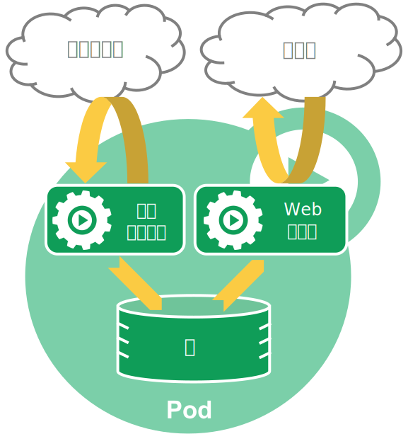

# pod

## 什么是pod

**Pod** 是可以在 Kubernetes 中创建和管理的、最小的可部署的计算单元。

Pod 类似于共享命名空间并共享文件系统卷的一组容器。

### pod是容器吗？

pod是一组（一个或多个）容器。 这些容器共享存储、网络、以及怎样运行这些容器的声明。 Pod 中的内容总是并置（colocated）的并且一同调度，在共享的上下文中运行。 

 注：pod中的容器是相对紧密地耦合在一起的， 在非云环境中，在相同的物理机或虚拟机上运行的应用类似于在同一逻辑主机上运行的云应用。

### pod是如何管理多个容器的？

Pod 被设计成支持形成内聚服务单元的多个协作过程（形式为容器）。pod中的容器会被字段安排到集群中的同应该物理机或虚拟机上，并可以进行调度。容器之间可以**共享资源和依赖**、**彼此通信**、**协调何时通信**。

例如：下面一个pod，他有两个服务，一个web服务器，负载提供web支持，另一个为内容服务器，负责远程更新这些文件，类似与边车（sidercar：在边车模式中， 边车进程负责协调应用程序与其他服务之间的通信，它可以通过本地的 API 或者基于消息传递来实现。边车进程通过与外部服务进行交互，提供了一种无侵入的方式来实现应用程序的分布式特性。）




有些 Pod 具有 **Init 容器**和 **应用容器**。 Init 容器会在启动应用容器之前运行并完成。

pod天生为其成员提供了两种共享资源：**网络**和**存储**

Kubernetes 集群中的 Pod 主要有两种用法：

- **运行单个容器的 Pod**：最常用的做法，运行单个容器就是单个应用，效果显著
- **运行多个协同工作的容器的 Pod**：比较常用的是边车模式（例如：dapr？）

## pod的作用

pod提供了如下功能

1. 最小操作单元：Pod 提供了一个容器编排的单元，可以将相关的容器组合在一起，共同运行和协作。
2. 资源共享：pod内的容器共享网络和存储，可以在多个容器之间可以更加便捷的通信和共享文件
3. 网络隔离：k8s为每个pod分配一个IP地址，可以独立网络通信，并且可以通过k8s的服务发现机制进行通信
4. 负载均衡和水平扩容：pod可以进行复制，提供了水平扩容能力，这样子方便k8s对pod进行负载均衡处理
5. 生命周期：pod提供了声明周期机制
6. 资源调度：pod是最小资源，可以根据策略调度到其他节点上


## 如何写一个pod

通常不用写一个pod，一般来说，工作负载（包括Deployment、 Job 和 DaemonSet等）会直接管理你的pod。

pod也是k8s对象，当然需要必须字段声明对象类型

```yaml
apiVersion: v1
kind: Pod
metadata:
  name: nginx
spec:
  containers:
  - name: nginx
    image: nginx:1.14.2
    ports:
    - containerPort: 80
```


## 为pod选择操作系统


## 规约

`spec.template.spec.containers[0].imagePullPolicy` 是一个容器规范的字段，用于指定容器如何拉取镜像。

`imagePullPolicy` 是容器的镜像拉取策略，它有以下几个可选值：

- `Always`：始终拉取最新的镜像。
- `IfNotPresent`：如果本地已经存在该镜像，则不拉取新镜像，否则拉取最新的镜像。
- `Never`：仅使用本地已经存在的镜像，如果本地不存在该镜像，则报错。


在 Kubernetes 中，`spec.template.spec.restartPolicy` 是一个 Pod 模板规范的字段，用于指定当容器退出时，该如何处理 Pod 的重启。

`restartPolicy` 具有以下三个可选值：

- `Always`：无论容器如何退出，都会自动重启 Pod。这是默认值。
- `OnFailure`：仅当容器以非零状态退出时才会自动重启 Pod。如果容器以零状态退出（即成功退出），则不会自动重启 Pod。
- `Never`：从不自动重启 Pod。无论容器以何种状态退出，都不会重启 Pod。